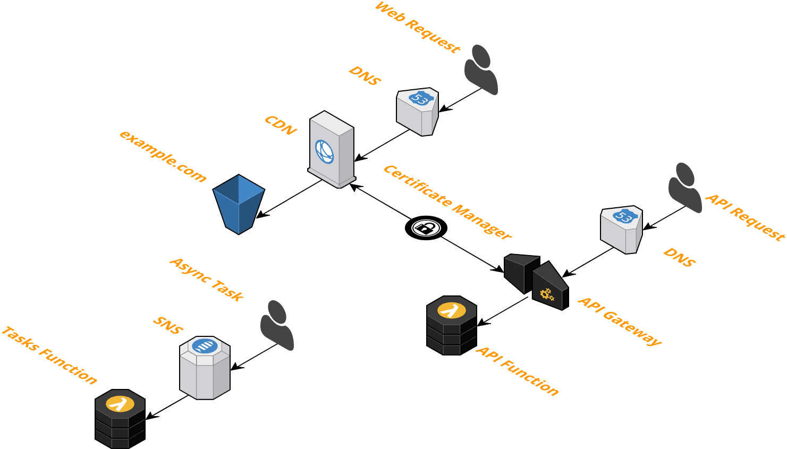
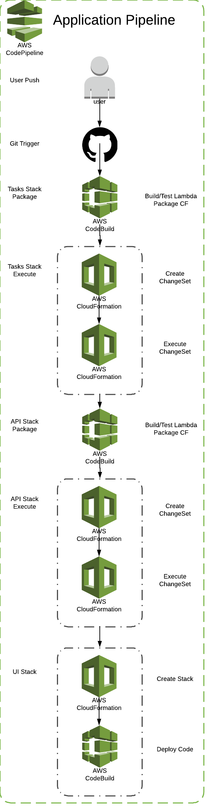

# Serverless Stack CI/CD
Serverless Stack with CI/CD - API + Static UI

This stack is completely serverless and powered by <a href="https://github.com/thestackshack/cim">CIM</a>.

It consists of:
* UI - Static S3 Website, CloudFront, SSL
* API - API Gateway, Lambda, SSL
* Async Tasks - SNS, Lambda

With every code push your Infrastructure will be updated.  

With every code push a new version of your Service will be built, tested, and deployed.

There are two environments `sandbox` and `prod`.  This makes it easy to test Infrastructure and Code changes before pushing to prod.

- sandbox -> `development` Git branch
- prod -> `master` Git branch

The Lambda function uses blue/green canary deployments.  5xx, 4xx, and latency are monitored to make sure the new deployment is stable.

## Architecture
[](architecture.png)

## Pipeline
[](pipeline.png)

## Setup
- Fork and clone this repo.
- Install [CIM](https://github.com/thestackshack/cim) (CloudFormation Utility)
- Register your domain with Route53
- Or point your existing domain to Route53
- Configure 'admin@yourdomain.com' to receive the SSL verification email
  - You will have to confirm this email address.  This is annoying and I've asked AWS to remove this step if the domain is used with Route5
- Install the [bootstrap.stack.yml](bootstrap.stack.yml) stack.

## Encrypt Secrets
In order to protect your configuration secrets like your GitHub token we need to create a KMS key first.

- Install https://github.com/ddffx/kms-cli and setup your AWS environment vars.
- Encrypt each string as outlined below.
- Add the encrypted strings to the [_cim.yml](_cim.yml).  The format is `${kms.decrypt(<encreted string>)}`


### How to Encrypt
Create a file called `encrypt.json`
```
{
  "keyId" : "<your kms key id>",
  "plainText": "<your client id>",
  "awsRegion": "<aws region>",
  "awsProfile": "<aws profile"
}
```
Use this command to perform the encryption : `kms-cli encrypt --file encrypt.json`


## Stack Up
Create the boostrap stack manually.  Once this is complete the pipelines will be created and then create the other stacks.
- Run `cim stack-up`
